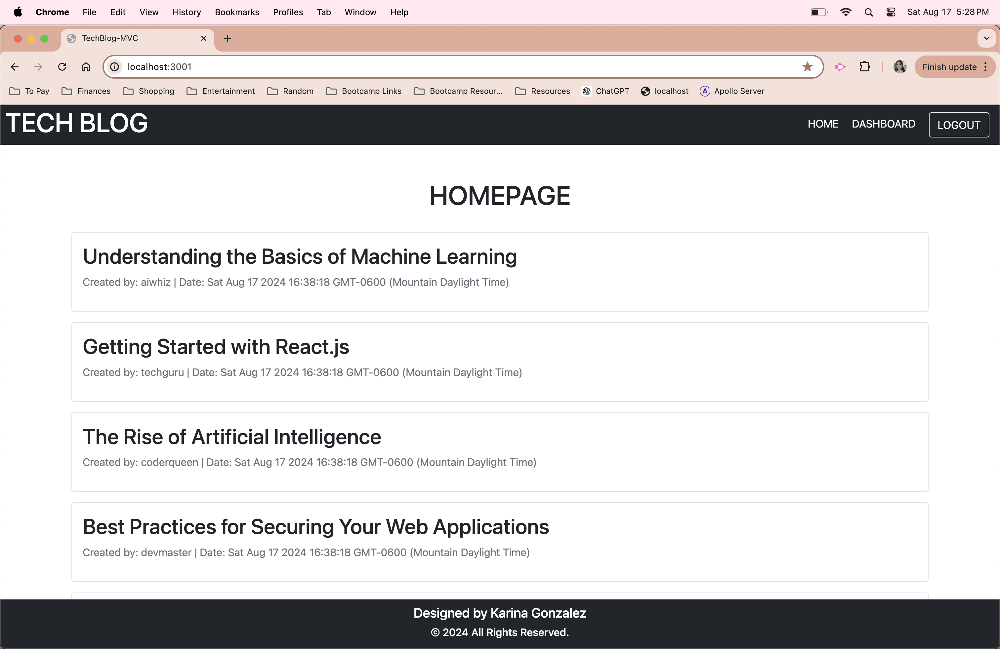
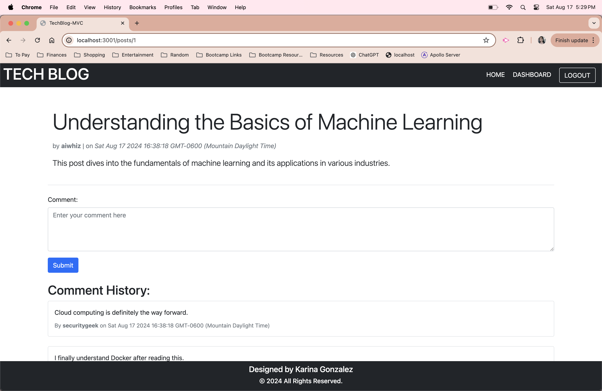
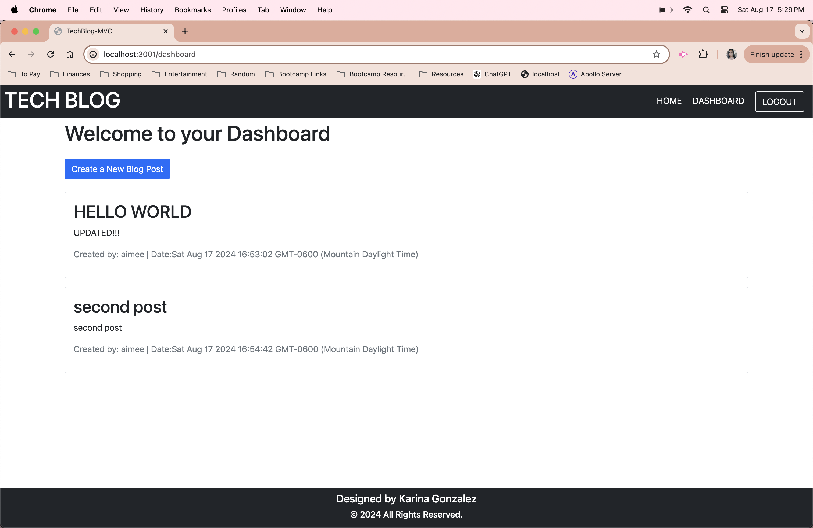

# TechBlog-MVC

## Description

Developing means spending time creating new applications and improving existing code for better applications. There are lots of resources out in the internet. Developers spend a lot of time reading documents for all kinds information needed to code and most importantly to learn new information that can help them improve their skills. With this tech blog, all users are able to create posts and comment on existing blogs. Being part of the converstion is essential to staying up to date on existing and new technologies. 

This tech blog was created from scratch with the intentions of sharing all kinds of information and conversations about technologies.
Creating this tech blog has taught me about using express handlebars, postgres, and sequelize. These connects the database for the models and creates express.js API for the controllers. 
I also used dotenv, bcrypt, express-session, and connect-session-sequelize for the purpose of authencation for users. 

## Installation

- EXPRESS HANDLEBARS (npm install express-handlebars)
- PG (npm install pg)
- SEQUELIZE (npm i sequelize)
- DOTENV (npm install dotenv --save)
- BCRYPT ((npm install bcrypt))
- EXPRESS-SESSION (npm install express-session)
- CONNECT-SESSION-SEQUELIZE (npm install connect-session-sequelize)

If you would like to clone this repo, run npm install and it should install all the packages listed in package.json.
npm start in the terminal will initialize the server.

If building a similar tech blog from scratch, copy and paste the installs listed a above in your terminal.

## Usage

To use my tech blog, simply follow the deployed link from render and start using.

## How to Contribute

EMAIL ME 📨 📧 
karinagonzalezal@gmail.com